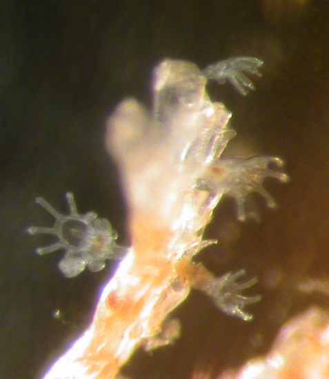

```{r setup, include = FALSE, cache = FALSE, purl = FALSE}
library(knitr)
library(ggplot2)
library(gridExtra)
source("assets/xaringan_setup.R")
library(xaringanExtra)
library(cowplot)
use_tile_view()
use_scribble()
use_search(show_icon = FALSE)
use_progress_bar(color = "#6d2b5e", location = "bottom", height = "10px")
use_freezeframe()
# use_webcam()
# use_panelset()
# use_extra_styles(hover_code_line = TRUE)

# http://tachyons.io/docs/
# https://roperzh.github.io/tachyons-cheatsheet/
use_tachyons()
```

class: middle, center, inverse

# Характеризуем данные

---

## С какими данными мы работаем

.pull-left[
.Large[Генеральная совокупность]
]

.pull-right-33[
.Large[Выборка]
]


--

.pull-left[
.Large[Параметры]
]

.pull-right-33[
.Large[Описательная статистика]
]
---

## Какие бывают данные 

![:col_header Категориальные данные, Числовые дискретые (счётные), Числовые непрерывные (мерные)]
![:col_list орёл или решка, оценка за экзамен, температура воздуха]
![:col_list цвет радуги, количество пластиковых пипеток в упаковке, рост]

---

## Характеризуем данные через связки описательных статистик 

.pull-left[
### Центральные тенденции <br/>(Statistics of location)

- Медиана (Median)

- Среднее значение (Mean)]

.pull-right[
### Меры разброса <br/>(Statistics of dispersion)

- Квантили (Quantiles)

- Дисперсия (Variance), <br/>cтандартное отклонение (Standard Deviation)]

---

# ЧАСТЬ 1. Медиана и квантили

## Медиана

Предположим, мы занимаемся селекцией яблонь и хотим охарактеризовать урожай любимой яблони, на которую возлагаем большие надежды.

```{r}
apples <- c(7.3, 9.7, 10.1,  9.5,  8.0,  9.2,  7.9,  9.1)
```

---

## Медиана

Наши данные в исходном виде выглядят примерно так:

```{r}
apples
```

.center[

]

Чтобы увидеть медиану, мы должны ранжировать, или отсортировать, наш вектор по возрастанию:

```{r}
sort(apples)
```


.center[

]
---

## Медиана

В ранжированном ряду медиана расположена так, что слева и справа от нее находится равное число измерений.

- Если n нечетное, то медиана = значение с индексом $\frac{n+1}{2}$. 
- Если n четное, то медиана посередине между $\frac{n}{2}$ и $\frac{n+1}{2}$ значениями.

```{r}
sort(apples)
```

Медиана находится в промежутке между значениями 9.1 и 9.2, т.е. 9.15

.center[

]

```{r}
median(apples) # Проверим себя
```

---

## Медиана устойчива к выбросам

Представим, что наши измерения пострадали от неаккуратности. Допустим сотрудник, которому мы поручили измерять яблоки, измерил также арбуз и записал этот результат вместе со всеми остальными.

```{r}
apples2 <- c(apples, 68) # Создадим вектор с новым значением
sort(apples2)
```

Что станет с медианой? Сильно ли она изменится?

```{r}
median(apples2)
```

---

## Медиана устойчива к выбросам, а среднее - нет

Давайте для сравнения посмотрим на среднее.

```{r}
mean(apples)
mean(apples2)
```

Единственное наблюдение-выброс сильно повлияет на величину среднего значения.

---

## Квантили

Квантили --- это значения, которые делят ряд наблюдений на равные части.

Они называются по-разному в зависимости от числа частей.

Примеры квантилей:

- 2-квантиль ("два-квантиль") --- медиана; 
- 4-квантиль ("четыре-квантиль")--- квартиль;  
- 100-квантиль ("сто-квантиль")--- перцентиль;

---

## Квартили

Квартиль --- частный случай квантиля.

Квартили делят распределение на __четыре__ равные части, каждая из которых включает по 25% значений.

- I квартиль отсекает как раз 25%.  
- II квартиль --- 50%. Это медиана.  
- III квартиль отсекает 75% значений.  

Квартили можно найти при помощи функции `quantile()`

```{r}
quantile(x = apples, probs = c(0.25, 0.5, 0.75))
```

---

## 5-number summary

Функция `quantile(x)` без указания значений вероятностей (`probs`) покажет нам квартили, минимум и максимум.

```{r}
quantile(apples)
```

5-number summary --- удобное краткое описание данных.

---

## Персентили

Персентиль --- это частный случай квантиля. Всего 99 персентилей, они делят ряд наблюдений на 100 частей.

Ничто не помешает нам узнать, например, какие значения отсекают 10% или 99% значений выборки. Подставим соответствующие аргументы:

```{r}
quantile(apples, probs = c(0.1, 0.99))
```

---

## Боксплот: 5-number summary на графике

.pull-left[
```{r boxplot.plain.1, fig.height = 5, fig.width = 4, purl=FALSE, echo=2}
op <- par(mar = c(0, 2, 0, 0))
boxplot(apples)
par(op)
```
]

.pull-right[
Отложим числа, характеризующие выборку, по оси Y:

- жирная линия --- медиана,
- нижняя и верхняя границы "коробки" --- это I и III квантили,
- усы --- минимум и максимум.

<br /><br />

Расстояние между I и III квартилями (высота "коробки") называется _интерквартильное расстояние_

Если в выборке есть выбросы (значения, отстоящие от границ "коробки" больше чем на 1.5 интерквартильных расстояния), то они будут изображены отдельными точками. 
]

---

## Подготовим все, чтобы построить график в ggplot2

```{r }
library(ggplot2)
theme_set(theme_bw())

apple_data <- data.frame(diameter = apples)
head(apple_data)
```

---

## Боксплот можно построить при помощи `geom_boxplot()`

```{r fig.width=4}
ggplot(data = apple_data) + 
  geom_boxplot(aes(x = 'Медиана \nи квантили', y = diameter))
```

- `x` --- категория (переменная или текстовое обозначение)  
- `y` --- зависимая переменная

---

class: middle, center, inverse

# Case study: диатомовые водоросли в желудках фильтраторов

---

## Case study: диатомовые водоросли в желудках фильтраторов. Самостоятельная работа

.pull-left[

В морских сообществах встречаются два вида фильтраторов, один из которых любит селиться прямо на поверхности тела другого.

*Tegella armifera* --- это вид-хозяин. Он может жить как сам по себе, так и вместе с симбионтом.

*Loxosomella nordgardi* --- вид-симбионт. Он практически никогда не встречается в одиночестве. 

<br />

Данные: Юта Тамберг
]
.pull-right[

]

---

## Case study: диатомовые водоросли в желудках фильтраторов

В файле `diatome_count.csv` дано количество диатомовых водорослей в желудках этих животных. Прочитаем эти данные и посмотрим на них:

```{r}
diatoms <- read.table("data/diatome_count.csv", 
                      header = TRUE, sep = "\t")
```

В таблице 2 переменные: 

- `sp` --- вид,
- `count` --- число водорослей в желудке.

В переменной `sp` есть три варианта значений:

- "host_free" --- хозяин без симбионта,
- "host_symbiont" --- хозяин с симбионтом,
- "symbiont" --- симбионт.

---

## Все ли правильно открылось? 

Смотрим первые несколько строк:

```{r}
head(diatoms)
```

Смотрим структуру:

```{r}
str(diatoms)
```

---

## Есть ли пропущенные значения?

```{r}
sum(! complete.cases(diatoms))
```

Что это за случаи?

```{r}
diatoms[!complete.cases(diatoms), ]
```

---

## Задание 1

```{r echo=FALSE, purl=FALSE}
head(diatoms)
```

Ваша задача рассчитать 5-number summary для количества диатомовых в желудках хозяев и симбионтов (всех трех категорий).

---

## Решение

```{r boxplot.plain.diatoms, purl=FALSE, fig.height = 3}
# 5-number summary для хозяев без симбионтов
host_f <- diatoms$count[diatoms$sp == "host_free"]
quantile(host_f, na.rm = TRUE)

# Для хозяев с симбионтами
host_s <- diatoms$count [diatoms$sp == "host_symbiont"]
quantile(host_s, na.rm = TRUE)

# Для одиноких симбионтов
symbiont <- diatoms$count [diatoms$sp == "symbiont"]
quantile(symbiont, na.rm = TRUE)
```

---

## Решение (более сложный, но краткий способ)

`tapply()` --- одна из функций семейства `*pply()`.

### split --- apply --- combine

Функция `tapply()` берет вектор `X` и... 

- делит (split) его на части по значениям в векторе `INDEX`
- применяет (apply) к каждой части функцию `FUN`
- соединяет (combine) результаты в одно целое в зависимости от их свойств

```{r}
tapply(X = diatoms$count, INDEX = diatoms$sp, FUN = quantile, na.rm = TRUE)
```

---

## Решение (самый современный способ)


Пакет `dplyr` содержит удобные функции для конвейерного способа обработки данных

```{r}
library(dplyr)
library(tidyverse)

diatoms %>% 
  group_by(sp) %>% 
  reframe(quantile = c(0.25, 0.5, 0.75),
            count = quantile(count, c(0.25, 0.5, 0.75), na.rm = TRUE))

```


---

## Боксплоты в ggplot2

Формат данных несколько сложен для человеческого глаза, зато очень подходит для ggplot.

```{r boxplot.ggplot.diatoms, fig.height = 4.5}
ggplot(data = diatoms, aes(y = count, x = sp)) + geom_boxplot()
```

---

## Медиана и квартили: непараметрические характеристики выборки

Главный плюс (но так же и минус) связки медиана + квартили это ее независимость от формы распределения.

Будь оно симметричным или с хвостом, 5-number summary опишет, а боксплот нарисует его с минимумом искажений. 

Но бывают случаи, когда приходится применять более специальные, но и более информативные характеристики.

---

class: middle, center, inverse

# ЧАСТЬ 2. Нормальное распределение - первое знакомство

---

## Все распределения равны, но некоторые равнее

Это непрерывное распределение, получаемое из мерных данных. Однако, многие распределения других типов тоже могут приближаться к нормальному.

```{r ND.1, echo=FALSE, purl=FALSE, fig.width=5.5, fig.height = 5, warning=FALSE}
library (ggplot2)
theme_set(theme_bw(base_size = 14))
Mu <- 10
Sigma <- 2
x <- seq(from = 0, to = 20, by = 0.1)
y <- dnorm(x = x, mean = Mu, sd = Sigma)
Norm <- data.frame(x, y)
ND_curve <- ggplot(data = Norm, aes(x=x, y=y)) +
  geom_line(color="steelblue", size=2) + 
#  geom_vline (xintercept = Mu) + 
  labs(x = "Values", y = "Probability density")
ND_hist <- ggplot(data = Norm, aes(x=x, y=y)) +
  geom_bar(stat = "identity", width = .05) +
#  geom_vline (xintercept = Mu) + 
  labs(x = "Values", y = "Relative frequency")
ND_curve
```

---

## Относительная частота и плотность вероятности

.pull-left[

```{r ND.2, echo=FALSE, purl=FALSE, fig.width=4, fig.height = 6, warning=FALSE}
ND_curve2 <- ND_curve + geom_vline(xintercept = 12, linetype="dotted", color = "red") + geom_vline(xintercept = 14, linetype="dotted", color = "red")
ND_hist2 <- ND_hist + geom_vline(xintercept = 12, linetype="dotted", color = "red") + geom_vline(xintercept = 14, linetype="dotted", color = "red")
grid.arrange(ND_hist2, ND_curve2, ncol = 1)
```
]

.pull-right[
На оси Y может быть отложена относительная частота значений Х в эмпирическом распределении, или вероятность из теоретического распределения.

На оси Х отложены значения Х в интервале от 0 до 20, в действительности же кривая простирается от $-\infty$ до $+\infty$

Площадь под кривой = 1.  Интегрируя кривую на промежутке $(k,..,l)$, можно узнать вероятность встречи значений в этом промежутке $(x_k,...x_l)$.

Но нельзя рассчитать вероятность одного значения $X = x_k$, так как это точка, и под ней нет площади.
]

---

## Приятные особенности нормального распределения

Нормальных кривых бесконечно много, и их описывает формула с параметрами $\mu$ и $\sigma$.

$$f(x) = \frac {1}{\sigma \sqrt{2 \pi}}\, e^{-\cfrac{(x-\mu)^2}{2\sigma^2}}$$

- $\mu$ --- среднее,
- $\sigma$ --- стандартное отклонение.

Достаточно знать значения этих двух параметов, чтобы восстановить или смоделировать любое нормальное распределение. И наоборот, если данные в выборке распределены нормально, то мы можем оценить параметры этого распределения.

---

class: middle, center, inverse

# ЧАСТЬ 3. Среднее и стандартное отклонение

---

## Центральная тенденция

### Среднее арифметическое

$$\bar{x}=\frac{\sum{x_i}}{n}$$

Рассчитаем вручную и проверим:

```{r}
sum(apples) / length(apples)

mean(apples)
```

---

## Как оценить разброс значений?

### Девиата (отклонение)
--- это разность между значением вариаты (измерения) и средним:

$$x_i - \bar{x}$$

```{r}
raw_deviates <- apples - mean(apples)
raw_deviates
```
 
```{r echo=FALSE}
ind <- seq(1,8,1)
app2 <- sort(apples)
app <- data.frame(apples, app2, ind)

pl_app1 <- ggplot(app, aes(x = ind, y = apples)) + 
  geom_point() + 
  xlab("Порядковый номер\nнаблюдения\n(индекс)") + 
  ylab("Диаметр яблока") + 
  geom_hline(yintercept = mean(apples), size = 1.2,  color = "steelblue") +
  geom_segment(aes(x = ind, y = apples, xend = ind, yend = mean(apples))) +
  scale_x_continuous(breaks = 1:10)
pl_app1 + coord_flip()
```

---

## Меры разброса

### Девиаты не годятся как мера разброса

К сожалению мы не можем просто сложить все значения девиат и поделить их на объем выборки. Сумма девиат всегда будет равна нулю.

```{r}
round(sum(raw_deviates))
```

$$\begin{aligned}
\sum{(x_i - \bar{x})} &= \sum x_i - \sum \bar x = \\
&= \sum x_i - n \bar x = \\
&= \sum x_i - n \cfrac{\sum x_i}{n} = 0
\end{aligned}$$

---

## Меры разброса

### Сумма квадратов = SS, Sum of Squares

Избавиться от знака девиаты можно, возведя значение в квадрат.

$$SS = \sum{{(x_i - \bar{x})}^2} \ne 0$$

```{r results="hide"}
sum(raw_deviates^2)
```

Но на что разделить $SS$, чтобы получить меру __усредненного__ отклонения значений от среднего?

---

## Меры разброса

### Как усреднить отклонения от среднего значения?

Мы не можем делить на $n$, поскольку отклонения от среднего  $x_i - \bar x$ не будут независимы.

Что это значит? Сумма отклонений всегда равна нулю $\sum{(x_i - \bar{x})} = 0$.  
Поэтому, если мы знаем $\bar x$ и $n - 1$ отклонений, то всегда сможем точно вычислить последнее отклонение.

<br />

$n - 1$ --- это число независимых значений (число степеней свободы --- __degrees of freedom__).

---

## Меры разброса

### Дисперсия = MS, Mean Square, Variance

Если мы теперь поделим сумму квадратов на объем выборки минус 1, то получим дисперсию по этой выборке.

$$s^2=\frac{\sum{(x_i - \bar{x})^2}}{n - 1}= \frac{SS}{n - 1}$$

```{r results="hide"}
sum(raw_deviates^2) / (length(apples) - 1)
var(apples)
```

Дисперсию не получится нарисовать на графике, т.к. там используются не отклонения, а их квадраты

---

## Меры разброса

### Среднеквадратичное/стандартное отклонение = Standard Deviation

Квадратный корень из дисперсии позволит вернуться к исходным единицам измерения

$$s = \sqrt{s^2} = \sqrt{\frac{\sum{(x_i - \bar{x})^2}}{n - 1}} = SD$$

Стандартное отклонение --- это средняя величина отклонения, и ее уже можно изобразить на графике.

```{r results="hide"}
sqrt(sum(raw_deviates^2) / (length(apples) - 1))
sd(apples)
```

---

## Среднее и стандартное отклонение при помощи `stat_summary()` 

.pull-left-33[
`stat_summary()` использует `geom_pointrange()`  
точка --- среднее, усы изображают $\pm$ стандартное отклонение

`mean_sdl()` рассчитывает координаты точки и усов,  ее аргумент `mult = 1` показывает, сколько стандартных отклонений отложить
]

.pull-right-66[
```{r}
ggplot(data = apple_data) + 
  stat_summary(geom = 'pointrange', fun.data = mean_sdl, 
               fun.args = list(mult = 1),
               aes(x = 'Среднее \nи стандартное отклонение', 
                   y = diameter))
```
]


---

## Особенности применения связки

- только вместе,

- чувствительны к выбросам,

- плохо работают с несимметричными распределениями.

---

## Как соотносятся способы оценки центра и размаха в выборке? 

```{r}
ggplot(data = apple_data) + 
  geom_boxplot(aes(x = 'Медиана \nи квантили', y = apples)) +
  stat_summary(geom = 'pointrange', fun.data = mean_sdl, 
               fun.args = list(mult = 1), 
               aes(x = 'Среднее \nи стандартное отклонение', y = diameter))
```

Медиана и среднее дают сходные результаты, если выборка не содержит выбросов (сильно отличающихся от других наблюдений).

