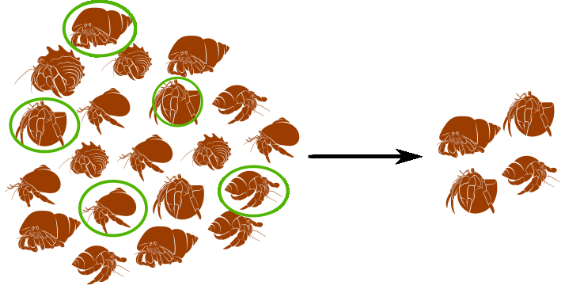
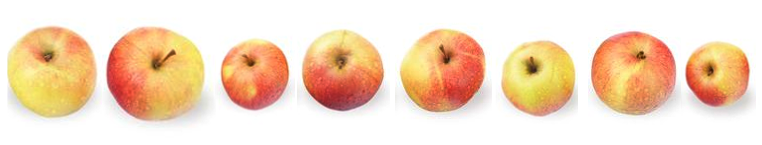
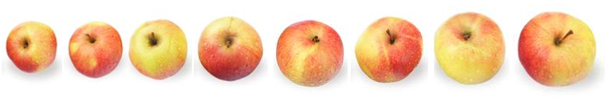
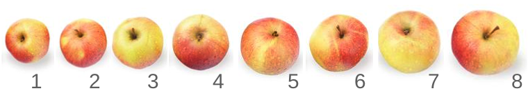

```{r setup, include = FALSE, cache = FALSE, purl = FALSE}
library(knitr)
library(ggplot2)
library(gridExtra)
source("assets/xaringan_setup.R")
library(xaringanExtra)
library(cowplot)
use_tile_view()
use_scribble()
use_search(show_icon = FALSE)
use_progress_bar(color = "#6d2b5e", location = "bottom", height = "10px")
use_freezeframe()
# use_webcam()
# use_panelset()
# use_extra_styles(hover_code_line = TRUE)

# http://tachyons.io/docs/
# https://roperzh.github.io/tachyons-cheatsheet/
use_tachyons()
```

class: middle, center, inverse

# Характеризуем данные

---

## С какими данными мы работаем

.pull-left[
.Large[Генеральная совокупность]
]

.pull-right-33[
.Large[Выборка]
]



--

.pull-left[
.Large[Параметры]
]

.pull-right-33[
.Large[Описательная статистика]
]
---

## Какие бывают данные 

![:col_header Категориальные данные, Числовые дискретые (счётные), Числовые непрерывные (мерные)]
![:col_list орёл или решка, оценка за экзамен, температура воздуха]
![:col_list цвет радуги, количество пластиковых пипеток в упаковке, рост]

---


## Как передать информацию о большом наборе данных?


```{r}
set.seed(12345)
dat <- round(rnorm(100, 10, 2), 1)

dat
```

---

## Способ 1. 

Можно построить график.

.pull-left-40[
```{r}
df <- data.frame(X = dat)

Pl <-
  df %>% 
  ggplot()

Pl + geom_histogram(aes(x = X), bins = 10)
```
]

.pull-right-40[
```{r}

Pl + geom_boxplot(aes(y = X))

```
]

---

## Способ 2.


Можно охарактеризовать медиану и квартили.

```{r}
summary(dat)
```

Можно ли по этим данным "воспроизвести" исходный ряд?

---
## Способ 3.

Можно смоделировать данные 

.pull-left-40[

```{r, echo = FALSE}
Pl + 
  geom_point(aes(x = X, y =0), position = position_jitter(height = 0.002), color = "blue") + 
  ylim(-0.01, 0.1) +
  geom_hline(yintercept = 0) +
  xlim(0, 20) 

```

]

.pull-right-40[

```{r, echo = FALSE}
ND_curve <- ggplot(data = data.frame(x = 0:10), aes(x = x)) +
  stat_function(fun = dnorm, args = list(mean = 10, sd = 2), 
                colour = 'red3', size = 1) +
  labs(y = 'Плотность вероятности')+
  xlim(0, 20)
  
ND_curve + 
  geom_point(data = df, aes(x = X, y = 0), position = position_jitter(height = 0.004), color = "blue")
```

]

Эта модель описывается всего двумя числами 

$$
\mu = 5 \\
\sigma = 2
$$

Можно ли по этим данным "воспроизвести" исходный ряд?


---

## Характеризуем данные через связки описательных статистик 

.pull-left[
### Центральные тенденции <br/>(Statistics of location)

- Медиана (Median)

- Среднее значение (Mean)]

.pull-right[
### Меры разброса <br/>(Statistics of dispersion)

- Квантили (Quantiles)

- Дисперсия (Variance), <br/>cтандартное отклонение (Standard Deviation)]

---

# ЧАСТЬ 1. Медиана и квантили

## Медиана

Предположим, мы занимаемся селекцией яблонь и хотим охарактеризовать урожай любимой яблони, на которую возлагаем большие надежды.

```{r}
apples <- c(7.3, 9.7, 10.1,  9.5,  8.0,  9.2,  7.9,  9.1)
```

---

## Медиана

Наши данные в исходном виде выглядят примерно так:

```{r}
apples
```

.center[

]

Чтобы увидеть медиану, мы должны ранжировать, или отсортировать, наш вектор по возрастанию:

```{r}
sort(apples)
```


.center[

]
---

## Медиана

В ранжированном ряду медиана расположена так, что слева и справа от нее находится равное число измерений.

- Если n нечетное, то медиана = значение с индексом $\frac{n+1}{2}$. 
- Если n четное, то медиана посередине между $\frac{n}{2}$ и $\frac{n+1}{2}$ значениями.

```{r}
sort(apples)
```

Медиана находится в промежутке между значениями 9.1 и 9.2, т.е. 9.15

.center[

]

```{r}
median(apples) # Проверим себя
```

---

## Медиана устойчива к выбросам

Представим, что наши измерения пострадали от неаккуратности. Допустим сотрудник, которому мы поручили измерять яблоки, измерил также арбуз и записал этот результат вместе со всеми остальными.

```{r}
apples2 <- c(apples, 68) # Создадим вектор с новым значением
sort(apples2)
```

Что станет с медианой? Сильно ли она изменится?

```{r}
median(apples2)
```

---

## Медиана устойчива к выбросам, а среднее - нет

Давайте для сравнения посмотрим на среднее.

```{r}
mean(apples)
mean(apples2)
```

Единственное наблюдение-выброс сильно повлияет на величину среднего значения.

---

## Квантили

Квантили --- это значения, которые делят ряд наблюдений на равные части.

Они называются по-разному в зависимости от числа частей.

Примеры квантилей:

- 2-квантиль ("два-квантиль") --- медиана; 
- 4-квантиль ("четыре-квантиль")--- квартиль;  
- 100-квантиль ("сто-квантиль")--- перцентиль;

---

## Квартили

Квартиль --- частный случай квантиля.

Квартили делят распределение на __четыре__ равные части, каждая из которых включает по 25% значений.

- I квартиль отсекает как раз 25%.  
- II квартиль --- 50%. Это медиана.  
- III квартиль отсекает 75% значений.  

Квартили можно найти при помощи функции `quantile()`

```{r}
quantile(x = apples, probs = c(0.25, 0.5, 0.75))
```

---

## 5-number summary

Функция `quantile(x)` без указания значений вероятностей (`probs`) покажет нам квартили, минимум и максимум.

```{r}
quantile(apples)
```

5-number summary --- удобное краткое описание данных.

---

## Персентили

Персентиль --- это частный случай квантиля. Всего 99 персентилей, они делят ряд наблюдений на 100 частей.

Ничто не помешает нам узнать, например, какие значения отсекают 10% или 99% значений выборки. Подставим соответствующие аргументы:

```{r}
quantile(apples, probs = c(0.1, 0.99))
```

---

## Боксплот: 5-number summary на графике

.pull-left[
```{r boxplot.plain.1, fig.height = 5, fig.width = 4, purl=FALSE, echo=2}
op <- par(mar = c(0, 2, 0, 0))
boxplot(apples)
par(op)
```
]

.pull-right[
Отложим числа, характеризующие выборку, по оси Y:

- жирная линия --- медиана,
- нижняя и верхняя границы "коробки" --- это I и III квантили,
- усы --- минимум и максимум.

<br /><br />

Расстояние между I и III квартилями (высота "коробки") называется _интерквартильное расстояние_

Если в выборке есть выбросы (значения, отстоящие от границ "коробки" больше чем на 1.5 интерквартильных расстояния), то они будут изображены отдельными точками. 
]

---

## Подготовим все, чтобы построить график в ggplot2

```{r }
library(ggplot2)
theme_set(theme_bw())

apple_data <- data.frame(diameter = apples)
head(apple_data)
```

---

## Боксплот можно построить при помощи `geom_boxplot()`

```{r fig.width=4}
ggplot(data = apple_data) + 
  geom_boxplot(aes(x = 'Медиана \nи квантили', y = diameter))
```

- `x` --- категория (переменная или текстовое обозначение)  
- `y` --- зависимая переменная

