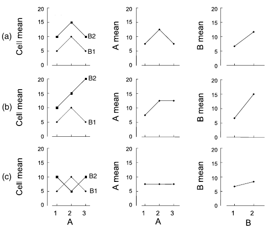

```{r setup, include = FALSE, cache = FALSE, purl = TRUE}
source("assets/xaringan_setup.R")
library(xaringanExtra)
use_tile_view()
use_scribble()
use_search(show_icon = FALSE)
use_progress_bar(color = "#98BF64", location = "bottom", height = "10px")
use_freezeframe()
# use_webcam()
# use_panelset()
# use_extra_styles(hover_code_line = TRUE)

# http://tachyons.io/docs/
# https://roperzh.github.io/tachyons-cheatsheet/
use_tachyons()
# source('support_mathmethr.R')
```


class: middle, center, inverse

## Двухфакторный дисперсионный анализ

---

## Вы сможете

- Проводить двухфакторный дисперсионный анализ и интерпретировать его результаты с учетом взаимодействия факторов
- Отличать фиксированные и случайные факторы и выбирать подходящую модель дисперсионного анализа

---

## Пример: Возраст и способы запоминания

Какие способы запоминания информации лучше работают для молодых и для пожилых? (Eysenck, 1974)

Факторы:

- `Age` - Возраст:
    - `Younger` - 50 молодых
    - `Older` - 50 пожилых (55-65 лет)
- `Process` - тип активности:
    - `Counting` - посчитать число букв
    - `Rhyming` - придумать рифму к слову
    - `Adjective` - придумать прилагательное
    - `Imagery` - представить образ
    - `Intentional` - запомнить слово

Зависимая переменная - `Words` - сколько вспомнили слов

.tiny[
Пример из http://www.statsci.org/data/general/eysenck.html
]

---

## Открываем данные

```{r}
memory <- read.table(file = "data/eysenck.csv", header = TRUE, sep = "\t")
# Все ли правильно открылось?
str(memory) # Структура данных
head(memory, 2) # Первые несколько строк файла
# Делаем факторы факторами
memory$Process <- factor(memory$Process, 
                         levels = c("Adjective", "Counting",
                                    "Imagery", "Intentional", "Rhyming"),
                         labels = c("Прилагательное", "Число букв", "Образ", "Запоминание", "Рифмы"))

memory$Age <- factor(memory$Age, levels = c("Older", "Younger"), 
                     labels = c("Пожилой", "Молодой"))
```

---

## Знакомимся с данными

```{r}
# Есть ли пропущенные значения 
# (особенно, в переменных, которые нас интересуют)?
colSums(is.na(memory))
# Каков объем выборки?
nrow(memory) # всего
table(memory$Age, memory$Process) # в группах
```

---

## Задание

Напишите код, чтобы построить график, на котором приведено среднее число слов (`Words`) для каждого возраста (`Age`) и способа запоминания (`Process`).

```{r gg-mean-conf-limit, echo=FALSE, purl=FALSE}
library(ggplot2)
theme_set(theme_bw())
ggplot(data = memory, aes(x = Age, y = Words, colour = Process)) + 
  stat_summary(geom = 'pointrange', fun.data = mean_cl_normal,
               position = position_dodge(width = 0.5))
```

---

## Решение

```{r gg-mean-conf-limit, echo=TRUE, purl=FALSE}
```


---

class: middle, center, inverse

# Двухфакторный дисперсионный анализ

---

## Двухфакторный дисперсионный анализ

Общая сумма квадратов $SS_t$ складывается из изменчивости связанной со всеми факторами и случайной изменчивости:

$$SS_t = \underbrace{SS_a + SS_b + SS_{ab}}_{\text{факторная изменчивость }SS_x} + \underbrace{SS_e}_{\text{случайная изменчивость }}$$
---

## Таблица дисперсионного анализа 

.small[
Источник <br\> изменчивости  | SS | df | MS | F 
----------- | --- | -- | -- | --
Название фактора А | $SS _A = an\sum\limits_{i}{(\bar A_i - \bar y)^2}$ | $df _A = a - 1$ | $MS _A = \frac{SS _A}{df _A}$ | $F _{df _A df _e} = \frac{MS _A}{MS _e}$ 
Название фактора В | $SS _B = bn\sum\limits_{j}{(\bar B_j - \bar y)^2}$ | $df _B = b - 1$ | $MS _B = \frac{SS _B}{df _B}$ | $F _{df _B df _e} = \frac{MS _B}{MS _e}$ 
Взаимодействие факторов A и B | $SS _{AB} = SS_t - SS_A - \\ - SS_B - SS_{AB}$ | $df _{AB} = (a - 1)(b - 1)$ | $MS _{AB} = \frac{SS _{AB}}{df _{AB}}$ | $F _{df _{AB} df _e} = \frac{MS _{AB}}{MS _e}$ 
Случайная | $SS _e = \sum\limits_{i}\sum\limits_j\sum \limits_k {(y _{ijk} - \bar y _{ij})^2}$ | $df _e = (n - 1)ab$ | $MS _e = \frac{SS _e}{df _e}$ 
Общая | $SS _t = \sum\limits_{i}\sum\limits_j\sum \limits_k {(y _{ijk} - \bar y)^2}$ | $df _t = N - 1$ | | 
]

- $i, \ldots, a$ --- уровни фактора A, $j, \ldots, b$ --- уровни фактора B, $k, ..., n$ --- индекс наблюдения в группе, $N$ --- общее число наблюдений
- $\bar y$ --- общее среднее значение, $\bar A_i$ --- средние в группах по фактору A, $\bar B_j$ --- в группах по фактору B
---

class: middle, center, inverse

# Взаимодействие факторов

---

## Взаимодействие факторов

Взаимодействие факторов --- когда эффект фактора B разный в зависимости от уровней фактора A и наоборот

.pull-left[

]

.pull-right[

На каких рисунках есть взаимодействие факторов?

--

- b, c - нет взаимодействия (эффект фактора B одинаковый для групп по фактору A, линии для разных групп по фактору B на графиках расположены параллельно)
- a, d - есть взаимодействие (эффект фактора B разный для групп по фактору A, на графиках линии для разных групп по фактору B расположены под наклоном).
]

.tiny[
Рисунок из Logan, 2010, fig.12.2
]

---

## Взаимодействие факторов может маскировать главные эффекты

.pull-left[

.tiny[
Рисунок из Quinn, Keough, 2002, fig.9.3
]
]

.pull-right[
**Если есть значимое взаимодействие**
- главные эффекты обсуждать не имеет смысла  
- пост хок тесты проводятся только для взаимодействия
]

---

class: middle, center, inverse

# Несбалансированные данные

---

## Сбалансированность данных

| A / B| B1 | B2 | B3 |
|-----| -----| -----| -----|
|A1 | $n_{11}$| $n_{12}$ |  $n_{13}$|
|A2 | $n_{21}$| $n_{22}$ |  $n_{23}$|

### Сбалансированные данные

Одинаковое число наблюдений во всех группах $n_{11} = n_{12} = \cdots = n_{ij}$

### Несбалансированные данные

Неодинаковое число наблюдений в группах

---

## Суммы квадратов в многофакторном дисперсионном анализе со взаимодействием

__Если данные сбалансированы, то ...__

- взаимодействие и эффекты факторов независимы,
- $SS_t = SS_a + SS_b + SS_{ab} + SS_e$,  
поэтому суммы квадратов (и тесты) можно посчитать в одном анализе,
- результат не зависит от порядка тестирования значимости факторов.

--

__Если данные несбалансированы, то ...__

- взаимодействие и эффекты факторов уже не являются полностью независимыми,
- $SS_t \ne SS_a + SS_b + SS_{ab} + SS_e$,  
и суммы квадратов не посчитать за один приём,
- результат анализа будет зависеть от порядка рассмотрения факторов (от "типа сумм квадратов").


### "Тип сумм квадратов"

— это один из общепринятых алгоритмов тестирования значимости факторов в дисперсионном анализе.

---

## Порядок тестирования значимости предикторов <br/> в дисперсионном анализе

.small[

"Типы сумм квадратов" | I тип | II тип | III тип
---- | ---- | ---- | ---- 
Название | Последовательный | Без учета взаимодействий высоких порядков | Иерархический
Порядок расчета SS | SS(A) <br/> SS(B&#124;A)  <br/> SS(AB&#124;B, A) | SS(A&#124;B) <br/> SS(B&#124;A) <br/> SS(AB&#124;B, A) | SS(A&#124;B, AB) <br/> SS(B&#124;A, AB) <br/> SS(AB&#124;B, A)
Величина эффекта зависит от выборки в группе | Да | Да | Нет
Результат зависит от порядка включения факторов в модель | Да | Нет | Нет
Команда R | aov() | Anova() (пакет car) |  Anova() (пакет car)

__Осторожно!__ Тестируя предикторы в разном порядке, вы тестируете разные гипотезы!

]

---

## Суммы квадратов III типа

__Если данные сильно не сбалансированы и анализ учитывает взаимодействие факторов__, то чтобы найти суммы квадратов придется подобрать несколько моделей.


- $Y = B + AB + \mathbf{A } \longrightarrow SS_a$
- $Y = A + AB + \mathbf{B} \longrightarrow SS_b$
- $Y = A + B + \mathbf{AB}  \longrightarrow SS_{ab}$

Суммы квадратов, рассчитанные __для последнего фактора в каждой модели__, будут использоваться в тестах.


--

- Старайтесь _планировать_ группы равной численности!
- Но если не получилось - не страшно:
    - Для фикс. эффектов неравные размеры - проблема при нарушении условий применимости только, если значения доверительной вероятности _p_ близки к выбранному критическому уровню значимости $\alpha$

---

class: middle, center, inverse

# Многофакторный дисперсионный анализ в R

---

## Задаем модель со взаимодействием в R

Взаимодействие обозначается `:` --- двоеточием

Формула модели со взаимодействием:

Y ~ A + B + A:B

Сокращенная запись такой же модели обозначает, что модель включает все главные эффекты и их взаимодействия:

Y ~ A*B


---

## Запись нашей модели 


```{r interaction-model, tidy=FALSE, eval=TRUE, echo=TRUE, purl=FALSE}
# Линейная модель дисперсионного анализа со взаимодействием факторов
mem_mod <- aov(Words ~ Age * Process, data = memory)

```

---

## Задание 

Проверим выполнение условий применимости дисперсионного анализа

Дополните код и ответьте на вопросы:

- Есть ли гомогенность дисперсий?
- Не видно ли паттернов в остатках?
- Нормальное ли у остатков распределение?

```{r eval=FALSE}
# 1) Данные для анализа остатков
mem_diag <- fortify()
head()
# 2) График расстояния Кука
ggplot(data = , aes(x = 1:nrow(), y = )) + geom_col()
# 3) Графики остатков от предикторов, включенных в модель
ggplot(data = mem_diag, aes(x = , y = )) + geom_boxplot()
ggplot(data = mem_diag, aes(x = , y = )) + geom_boxplot()
# Если есть два категориальных предиктора, можно их изобразить одновременно
ggplot(data = mem_diag, aes(x = , y = ,  = Age)) + geom_boxplot()
# 4) Графики остатков от предикторов, не вошедших в модель (если есть)

# 5) Квантильный график остатков
library()
 (mem_mod)
```

---

## Решение: Данные для анализа остатков

```{r, purl=FALSE}
mem_diag <- fortify(mem_mod)
head(mem_diag)
```

---

## Решение: Графики остатков от предикторов в модели

```{r purl=FALSE, eval=FALSE}
ggplot(data = mem_diag, aes(x = Age, y = .stdresid)) + 
  geom_boxplot()
ggplot(data = mem_diag, aes(x = Process, y = .stdresid)) + 
  geom_boxplot()
ggplot(data = mem_diag, aes(x = Process, y = .stdresid, colour = Age)) + 
  geom_boxplot()
```


```{r purl=FALSE, echo=FALSE, fig.width=10}
library(cowplot)
plot_grid(
ggplot(data = mem_diag, aes(x = Age, y = .stdresid)) + 
  geom_boxplot(),
ggplot(data = mem_diag, aes(x = Process, y = .stdresid)) + 
  geom_boxplot(),
ggplot(data = mem_diag, aes(x = Process, y = .stdresid, colour = Age)) + 
  geom_boxplot(),
ncol = 3, rel_widths = c(0.2, 0.36, 0.44))
```

- маленький разброс остатков в группах `Counting` и `Rhyming` у обоих возрастов


---

## Решение: Квантильный график остатков

```{r purl=FALSE, fig.height=4}
library(car)
qqPlot(mem_mod)
```

--

- Нет значительных отклонений от нормального распределения

---

## Результаты дисперсионного анализа

```{r}
# Anova() из пакета car
Anova(mem_mod, type = 3)
```

--

- Взаимодействие значимо, факторы отдельно можно не тестировать, так как взаимодействие может все равно изменять их эффект до неузнаваемости.
- Нужно делать пост хок тест по взаимодействию факторов.

---

## Задание

Дополните этот код, чтобы посчитать пост хок тест Тьюки.


```{r eval=FALSE, purl=TRUE}

memory_tukey <- TukeyHSD()

memory_tukey
```

---

## Решение


```{r}
memory_tukey <- TukeyHSD(mem_mod)

memory_tukey

```

---

## Take home messages

- Многофакторный дисперсионный анализ позволяет оценить взаимодействие факторов. Если оно значимо, то лучше воздержаться от интерпретации их индивидуальных эффектов
- В случае, если численности групп неравны (несбалансированные данные), лучше использовать III тип сумм квадратов

