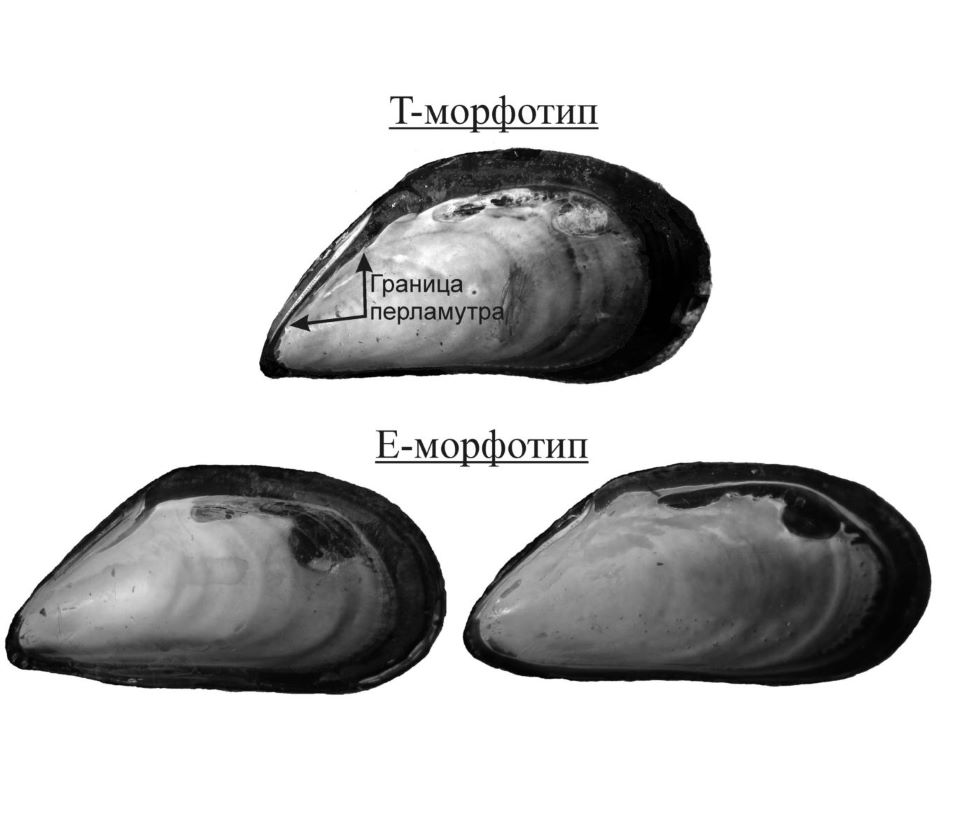

```{r setup, include=FALSE}
library(knitr)
opts_chunk$set(echo = FALSE)
```


##### *Mytilus spp.*, прикрепленные к фукоидам, получают ряд преимуществ, но этом излишняя масса моллюсков снижает плавучесть фукоида. Бороться с обрастанием он может с помощью выделений, влияющих на силу прикрепления или активность выделения биссуса. Было поставлено два эксперимента для оценки воздействия на количество биссуса и прочность прикрепления к субстрату. Под воздействием *Fucus vesiculosus* морфотипы уменьшали количество биссуса. Сила прикрепления значимо не различалась, но мидии T-морфотипа под влиянием *Fucus vesiculosus* прикреплялись сильнее, чем мидии Е-морфотипа.

# Введение
  Среди многочисленных симфизиологических связей [@bekl_1970] прямые топические взаимодействия играют наиболее важную роль. При таких взаимодействиях один из организмов создает благоприятные условия для жизни другого. В частности, тела организмов одно вида могу служить субстратом для прикрепления организмов другого вида. 

В условиях морской литорали прямые топические связи ярко выражены в случае  взаимоотношения мидий *Mytilus spp*. с бурыми водорослями *Ascophyllum nodosum* и *Fucus vesiculosus* [@chovgan_2017]. Моллюски, прикрепляясь к талломам водорослей своими биссусными нитями получают целый ряд преимуществ: недоступность для хищников, лучшую аэрацию воды. Однако для самих фукоидов обрастатели приносят, скорее, вред. Так, мидии увеличивают вес водорослей, чем снижают их плавучесть и на прижатых фукоидах образуется мидиевая щетка, что в конечном счете приводит к гибели растения. Известно, что некоторые водоросли, например *Ochrophyta*, борются с обрастанием мидиями с помощью выделения различных метаболитов [@da_gama_2014], которые мешают прикрепляться моллюскам. 

Роль фукоидов, как субстрата, была выявлена и в другом аспекте. Было показано, что два вида мидий, обитающих в Белом море (*M. trossulus* и *M. edulis*), демонстрируют разный характер связи с водорослями. Относительное обилие первого вида на фукоидах оказывается выше, чем на грунте [@katolikova_2016]. Эта асимметрия позволяет ожидать, что если фукоиды оказывают воздействие на мидий, то возможно, что  *M. edulis* более подвержены влиянию метаболитов водорослей, чем *M. trossulus*.

Мы предположили, что при воздействии веществ, выделяемых фукоидами, сила прикрепления и количество биссусных нитей будет снижаться. При этом мы ожидаем, что у *Mytilus trossulus* реакция будет менее выражена, чем у *M. edulis*. 

# Материалы и методы

## Идентификация видовой принадлежности мидий

В этой работе мы применяли разделение мидий на морфотипы по полосе конхеалинового слоя рядом с лигаментом. По этому признаку мидии были разделены на две группы: Т-морфотип (соответствует *M. trossulus*) и Е-морфотип (соответствует *M. edulis*) [@khaitov_2021]. Мидии Е-морфотипа обладали перламутровым слоем, плотно прилегающем к лигаменту, в то время как у Т-морфотипа лигамент отделялся от перламутрового слоя конхеалиновым (рис. 1). 

{width=60%}

```{r, echo=FALSE, warning=FALSE, message=FALSE}
library(readxl)
library(ggplot2)
library(broom)
library(knitr)
library(dplyr)
```


```{r, echo=FALSE, message=FALSE, warning=FALSE}
bys <- read_excel('Data/FucBys_2023.xlsx', na = "NA", sheet = "Experiment FucBys")
bys$Treatment <- factor(bys$Treatment)
bys$Treatment <- relevel(bys$Treatment, ref = 'Control')
labe = c('Ascophyllum', 'Контроль', 'Fucus')

frc <- read_excel('Data/FucBys_2023.xlsx', na = "NA", sheet = "Fuc_Tred_Force")
frc$True_Force <- frc$Force - frc$Weight / 1000 * 9.81
frc$True_Force[(!is.na(frc$True_Force)) & frc$True_Force < 0] <- 0


```

## Математические методы

Среднеквадратичное отклоненеие вычислялось по следующей формуле:

$$
sd = \sqrt{\frac{\sum{(x_i - \bar{x})^2}}{n-1} }
$$


# Результаты

## Количество биссуса

Под влиянием *Fucus vesiculosus* оба морфотипа значительно уменьшали количество биссуса по сравнению с контролем. Кондиционированная вода от  *Ascophyllum nodosum* практически не влияла на количество биссуных бляшек. В садках типа *"Ascophyllum"* и *"контроль"* мидии Т-морфотипа выделял больше биссуса, чем мидии Е-морфотипа. Практически равное количество наблюдается в типе *Fucus* (рис. 4). 


```{r, echo=FALSE, message=FALSE, fig.cap= "Рисунок 4. Количество биссусных бляшек в бакпечатках с разной кондиционированной водой", warning=FALSE}
labe = c('Ascophyllum', 'Контроль', 'Fucus')
ggplot(bys, aes(x = Treatment, y = N_byss, fill = Morphotype)) + 
  geom_boxplot() +
  theme_bw()+
  labs(x = 'Тип', y = 'Количество биссуса', fill = 'Морфотип')+
  scale_x_discrete(label = labe)
```


Дисперсионный анализ показал значимое влияние типа воды и морфотипа мидии. Взаимодействие тоже было значимым, что указывает на различную реакции Т- и Е-морфотипа (табл. 2). Тест Тьюки выявил значимые отличия между *"контролем"* и типом *"Fucus"* .  Значимых отличий между *"Ascophyllum"* и *"контролем"* не выявлено. Различия между морфотипами оказались значимыми в типах *"Ascophyllum"*, *"контроль"*, однако в пределах типа *"Fucus"* количество биссуса между морфотипами значимо не различалось (табл. 3).


```{r, echo=FALSE, message=FALSE, warning=FALSE}
mod <-lm(log(N_byss+1) ~ Treatment + Morphotype + Treatment:Morphotype, data = bys) 

anova(mod)
```


# Обсуждение результатов


Во втором эксперименте мы не наблюдали изменения силы прикрепления в садках с фукусами по сравнению с контролем. При этом, в контрольной группе садков сила прикрепления не отличалась между морфотипами. Вероятно, время эксперимента оказалось недостаточным. Однако в садках, которые находились под воздействием *Fucus vesiculosus* мидии Т-морфотипа прикреплялись значимо сильнее мидий Е-морфотипа, что говорит о большей чувствительности Е-морфотипа к воздействию со стороны фукоидов. Это согласуется с наблюдаемой закономерностью в распределении мидий разных морфотипов по субстратам: относительное обилие мидий Е-морфотипа выше на грунте, чем на талломах фукоидов [@katolikova_2016]. 


# Благодарности
Хотелось бы выразить благодарность Вадиму Михайловичу Хайтову как научному руководителю, Кандалакшскому заповеднику за возможность работы и команде LVII Беломорской экспедиции за помощь в постановке эксперимента.

# Список литературы


